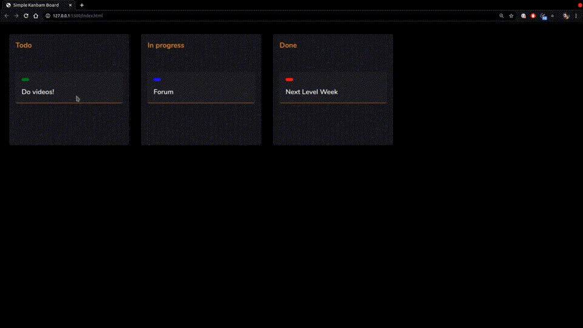

<h1 align="center">Drag and Drop 👋</h1>

  
  
  

> Código resultante da masterclass sobre Drag and Drop da Rocketseat

### Link para a MasterClass

[Drag and Drop Raiz com a API do HTML, CSS e JavaScript | Masterclass #16](https://www.youtube.com/watch?v=6wn8hpUcEcM)

<h2 align="center">
   Aplicação
</h2>

<h1 align="center">
   
</h1>

## Autor

👤 **Daniel Ribeiro**

- Twitter: [@defauth8](https://twitter.com/defauth8)
- Github: [@defauth98](https://github.com/defauth98)
- LinkedIn: [@daniel-ribeiro-397604164](https://linkedin.com/in/daniel-ribeiro-397604164)
